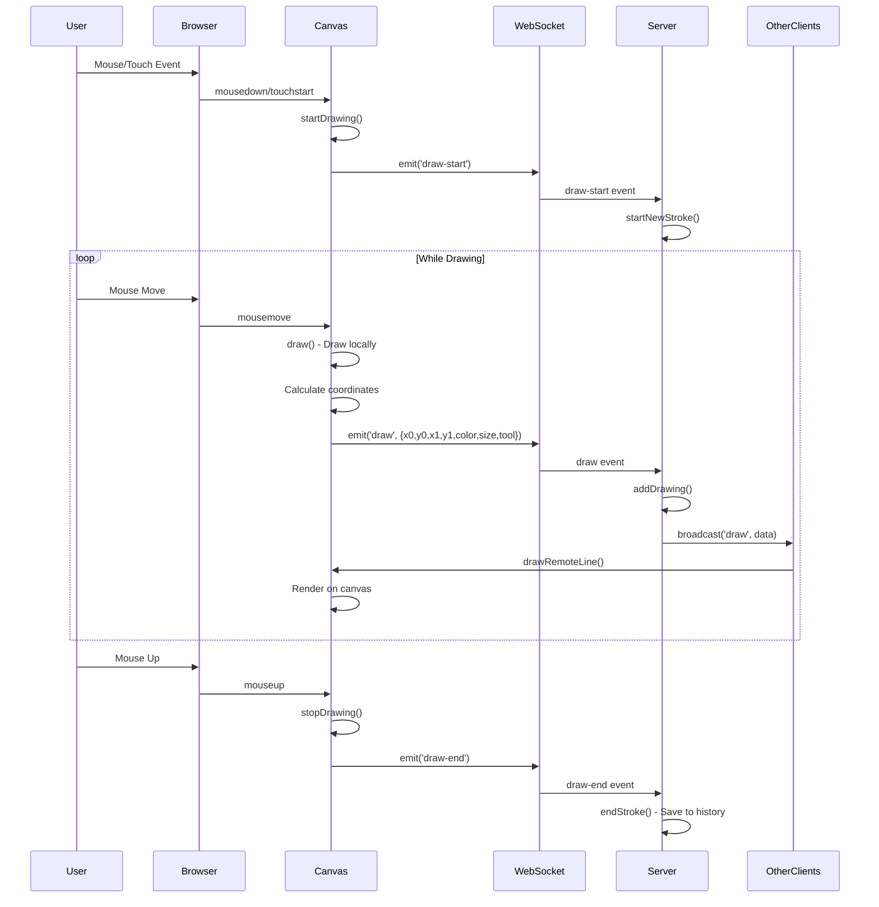

# Architecture Documentation

This document provides a detailed overview of the collaborative canvas architecture, data flow, and design decisions.

## Data Flow Diagram

### Overview: Drawing Event Flow (User → Canvas)



### Detailed Flow Breakdown

```
┌─────────────────────────────────────────────────────────────────┐
│                        USER INTERACTION                          │
└────────────────────────┬────────────────────────────────────────┘
                         │
                         ▼
┌─────────────────────────────────────────────────────────────────┐
│                    CLIENT-SIDE (Browser)                        │
├─────────────────────────────────────────────────────────────────┤
│  1. Event Listener (mousedown/mousemove/mouseup)                │
│  2. Canvas.js - Drawing Logic                                   │
│     ├─ startDrawing() - Initialize stroke                       │
│     ├─ draw() - Draw line segment                               │
│     └─ stopDrawing() - Finalize stroke                          │
│  3. WebSocket Client - Communication Layer                      │
│     └─ Emit events: draw-start, draw, draw-end                  │
└────────────────────────┬────────────────────────────────────────┘
                         │
                         ▼ (WebSocket Connection)
┌─────────────────────────────────────────────────────────────────┐
│                    SERVER-SIDE (Node.js)                        │
├─────────────────────────────────────────────────────────────────┤
│  1. Socket.IO Server - Event Handler                            │
│  2. DrawingState.js - State Management                          │
│     ├─ startNewStroke() - Create stroke object                  │
│     ├─ addDrawing() - Add line to current stroke                │
│     └─ endStroke() - Push to history array                      │
│  3. Broadcast to Room - Send to other clients                   │
└────────────────────────┬────────────────────────────────────────┘
                         │
                         ▼ (Broadcast via Socket.IO)
┌─────────────────────────────────────────────────────────────────┐
│                   OTHER CLIENTS (Browsers)                      │
├─────────────────────────────────────────────────────────────────┤
│  1. Receive 'draw' event                                        │
│  2. Canvas.drawRemoteLine()                                     │
│  3. Render on local canvas in real-time                         │
└─────────────────────────────────────────────────────────────────┘
```

## 📡 WebSocket Protocol

### Connection Lifecycle

```
Client                          Server
  │                               │
  ├────── connect ──────────────> │
  │                               │
  │ <──── user-id ────────────────┤ (Assign unique ID)
  │                               │
  ├────── user-join ────────────> │
  │      {name, color}            │
  │                               │
  │ <──── initial-state ──────────┤ (Send existing strokes)
  │ <──── users-update ───────────┤ (Send user list)
  │                               │
  │         [Active Session]      │
  │                               │
  ├────── disconnect ───────────> │
  │                               │
```

### Message Types & Payloads

#### 1. **Connection Messages**

**Client → Server:**
```javascript
// User joins the room
socket.emit('user-join', {
  name: 'User-123',
  color: '#FF6B6B'
});
```

**Server → Client:**
```javascript
// Assign user ID
socket.emit('user-id', 'socket_abc123');

// Send initial canvas state
socket.emit('initial-state', {
  strokes: [
    {
      id: '1234-userId',
      userId: 'socket_xyz',
      lines: [...],
      timestamp: 1234567890
    }
  ]
});

// Update user list
socket.emit('users-update', [
  { id: 'socket_abc', name: 'User-123', color: '#FF6B6B' },
  { id: 'socket_xyz', name: 'User-456', color: '#4ECDC4' }
]);
```

#### 2. **Drawing Messages**

**Client → Server:**
```javascript
// Start drawing
socket.emit('draw-start');

// Drawing data (sent continuously while drawing)
socket.emit('draw', {
  x0: 100,        // Start X coordinate
  y0: 150,        // Start Y coordinate
  x1: 102,        // End X coordinate
  y1: 152,        // End Y coordinate
  color: '#000000', // Stroke color
  size: 5,        // Brush size
  tool: 'pen'     // Tool type: 'pen' or 'eraser'
});

// End drawing
socket.emit('draw-end');
```

**Server → Other Clients:**
```javascript
// Broadcast drawing data to other users
socket.to(roomId).emit('draw', {
  x0: 100,
  y0: 150,
  x1: 102,
  y1: 152,
  color: '#000000',
  size: 5,
  tool: 'pen'
});
```

#### 3. **Cursor Tracking**

**Client → Server:**
```javascript
socket.emit('cursor-move', {
  x: 250,
  y: 300
});
```

**Server → Other Clients:**
```javascript
socket.to(roomId).emit('cursor-move', {
  userId: 'socket_abc123',
  x: 250,
  y: 300,
  color: '#FF6B6B'
});
```

#### 4. **Canvas Operations**

**Client → Server:**
```javascript
// Undo last stroke
socket.emit('undo');

// Redo last undone stroke
socket.emit('redo');

// Clear entire canvas
socket.emit('clear-canvas');
```

**Server → All Clients:**
```javascript
// Redraw canvas with updated strokes (for undo/redo)
io.to(roomId).emit('redraw-canvas', [
  { id: '1', userId: 'user1', lines: [...] },
  { id: '2', userId: 'user2', lines: [...] }
]);

// Clear canvas for all users
io.to(roomId).emit('clear-canvas');
```

### Message Frequency & Performance

| Event Type | Frequency | Payload Size | Optimization |
|------------|-----------|--------------|--------------|
| `draw` | ~60/sec (during drawing) | ~50 bytes | Sent only during active drawing |
| `cursor-move` | ~30/sec | ~30 bytes | Throttled by browser mousemove |
| `draw-start` | Once per stroke | ~10 bytes | Minimal |
| `draw-end` | Once per stroke | ~10 bytes | Minimal |
| `undo/redo` | User-triggered | ~10 bytes | Rare |
| `users-update` | On join/leave | ~100-500 bytes | Infrequent |

## Undo/Redo Strategy

### Architecture Decision: Global Undo/Redo

**Chosen Approach:** Single shared undo/redo stack for all users

```
┌─────────────────────────────────────────────────────────────┐
│                    GLOBAL UNDO/REDO STACK                    │
├─────────────────────────────────────────────────────────────┤
│                                                              │
│  Active Strokes Array:                                       │
│  ┌──────────────────────────────────────────────────────┐  │
│  │ [Stroke1] [Stroke2] [Stroke3] [Stroke4] [Stroke5]    │  │
│  └──────────────────────────────────────────────────────┘  │
│                                                 ▲            │
│                                                 │            │
│                                           Current Position   │
│                                                              │
│  Undone Strokes Array:                                      │
│  ┌──────────────────────────────────────────────────────┐  │
│  │ [Empty - cleared when new stroke is added]           │  │
│  └──────────────────────────────────────────────────────┘  │
│                                                              │
└─────────────────────────────────────────────────────────────┘
```

### Implementation Details

```javascript
// DrawingState.js

class DrawingState {
  constructor() {
    this.strokes = [];         // Active strokes
    this.undoneStrokes = [];   // Redo stack
  }

  // When user clicks UNDO
  undo() {
    if (this.strokes.length > 0) {
      const removedStroke = this.strokes.pop();      // Remove last stroke
      this.undoneStrokes.push(removedStroke);        // Add to redo stack
      return removedStroke;
    }
    return null;
  }

  // When user clicks REDO
  redo() {
    if (this.undoneStrokes.length > 0) {
      const restoredStroke = this.undoneStrokes.pop(); // Get from redo stack
      this.strokes.push(restoredStroke);               // Add back to active
      return restoredStroke;
    }
    return null;
  }

  // When new stroke is added
  endStroke(userId) {
    const stroke = this.currentStrokes.get(userId);
    if (stroke && stroke.lines.length > 0) {
      this.strokes.push(stroke);
      this.undoneStrokes = [];  // CLEAR REDO STACK - Important!
    }
  }
}
```

### Flow Diagram: Undo Operation

```
User A clicks UNDO
       │
       ▼
Client sends 'undo' event
       │
       ▼
Server: drawingState.undo()
       │
       ├─ Pop last stroke from strokes[]
       ├─ Push to undoneStrokes[]
       └─ Return updated strokes array
       │
       ▼
Server: io.to(room).emit('redraw-canvas', strokes)
       │
       ▼
ALL Clients (including User A)
       │
       ├─ Clear canvas
       ├─ Redraw all strokes from array
       └─ Result: Last stroke removed for everyone
```

### Why Global Instead of Per-User?

**Advantages:**
- ✅ **Simplicity**: Single source of truth
- ✅ **Consistency**: All users see the same state
- ✅ **Fair**: Last action undone (LIFO - Last In First Out)
- ✅ **Collaborative**: Acts like a shared physical whiteboard

**Trade-offs:**
- ❌ Users can undo others' work
- ❌ No per-user undo history
- ❌ Can be confusing in high-activity sessions

**Alternative Considered (Not Implemented):**
Per-user undo/redo would require:
- Tracking stroke ownership
- Complex conflict resolution
- More complex UI ("Undo my last stroke")
- Higher cognitive load

**Decision:** Global undo/redo is more appropriate for a collaborative canvas where all users work together on a shared creation.

## ⚡ Performance Decisions

### 1. **Real-time Drawing: Stroke Segments vs Full Paths**

**Chosen:** Send individual line segments continuously

```javascript
// CHOSEN APPROACH
// Send each mouse movement as a line segment
mousemove → {x0: 100, y0: 100, x1: 102, y1: 101} → Server → Other Clients

// NOT CHOSEN
// Buffer entire stroke and send at the end
mouseup → {path: [[100,100], [102,101], ...]} → Server → Other Clients
```

**Why?**
- **Real-time**: Users see drawing stroke-by-stroke (smooth experience)
- **Low latency**: Each segment is ~50 bytes, sent immediately
- **Better UX**: Feels like drawing together in person
- **Trade-off**: More network messages (~60/sec while drawing)

**Performance Impact:**
- Bandwidth: ~3KB/sec per active drawer (acceptable for modern networks)
- Server load: Minimal (just broadcasting, no processing)

### 2. **Canvas Rendering: Direct Draw vs Layered**

**Chosen:** Single canvas with direct drawing

```javascript
// CHOSEN APPROACH
drawLine(data) {
  this.ctx.beginPath();
  this.ctx.moveTo(data.x0, data.y0);
  this.ctx.lineTo(data.x1, data.y1);
  this.ctx.stroke();  // Draw immediately to canvas
}

// NOT CHOSEN: Multiple layers
// backgroundCanvas + drawingCanvas + previewCanvas
```

**Why?**
- **Simplicity**: Single canvas, easier to manage
- **Performance**: No layer compositing overhead
- **Memory**: Lower memory footprint
- **Trade-off**: Must redraw entire canvas for undo/redo

**Optimization for Undo/Redo:**
```javascript
redrawAllStrokes(strokes) {
  this.ctx.clearRect(0, 0, this.canvas.width, this.canvas.height);
  strokes.forEach(stroke => {
    stroke.lines.forEach(line => {
      this.drawLine(line);  // Replay all strokes
    });
  });
}
```

### 3. **State Management: In-Memory vs Database**

**Chosen:** In-memory storage (Map/Array)

```javascript
// CURRENT IMPLEMENTATION
class DrawingState {
  constructor() {
    this.strokes = [];              // In-memory array
    this.users = new Map();         // In-memory map
  }
}

// NOT IMPLEMENTED: Database persistence
// MongoDB, Redis, PostgreSQL, etc.
```

**Why?**
- **Fast**: O(1) access, no I/O overhead
- **Simple**: No database setup required
- **Sufficient**: For real-time collaboration, speed > persistence
- **Trade-off**: Data lost when server restarts

**When to add database:**
- Need to save drawings permanently
- Want to load previous sessions
- Supporting many concurrent rooms

### 4. **Eraser Implementation: Composite Operation**

**Chosen:** Canvas composite operation (`destination-out`)

```javascript
// CHOSEN APPROACH
if (data.tool === 'eraser') {
  this.ctx.globalCompositeOperation = 'destination-out';
  this.ctx.strokeStyle = 'rgba(0,0,0,1)';
  this.ctx.stroke();  // Erases by removing pixels
}

// NOT CHOSEN: White color
// this.ctx.strokeStyle = '#FFFFFF';  // Just draws white
```

**Why?**
- **True erasing**: Removes pixels (transparency)
- **Works on any background**: Not just white
- **Proper behavior**: Like a real eraser
- **Trade-off**: Slightly more complex logic

### 5. **Event Throttling: None (Intentional)**

**Chosen:** No throttling on draw events

```javascript
// CURRENT: Send every mousemove
mousemove → emit('draw', data)

// NOT IMPLEMENTED: Throttle to reduce messages
// throttle(mousemove, 16ms) → emit('draw', data)  // ~60fps
```

**Why?**
- **Smoothness**: Higher fidelity drawing
- **Acceptable load**: Modern networks handle it well
- **Trade-off**: More messages, but negligible impact

**If optimization needed:**
```javascript
// Future: Throttle cursor-move (not critical)
const throttledCursorMove = _.throttle((x, y) => {
  wsClient.sendCursorPosition(x, y);
}, 50); // 20 updates/sec instead of 60
```

### Performance Metrics

| Operation | Time Complexity | Space Complexity |
|-----------|----------------|------------------|
| Add stroke | O(1) | O(n) per stroke |
| Undo | O(1) | O(1) |
| Redo | O(1) | O(1) |
| Redraw canvas | O(n*m) | O(1) |
| Clear canvas | O(1) | O(1) |

*n = number of strokes, m = lines per stroke*

## Conflict Resolution

### Scenario: Simultaneous Drawing

```
Time →
  0ms    100ms   200ms   300ms   400ms
User A: ─────●─────●─────●─────●─────●
User B: ───────●─────●─────●─────●─────

Server receives:
  50ms: User A stroke 1
  70ms: User B stroke 1
  150ms: User A stroke 2
  170ms: User B stroke 2
  ...
```

### Strategy: Last-Write-Wins + Order Preservation

**Approach:**
1. **No locking**: Users can draw simultaneously
2. **Order by arrival**: Server processes events in received order
3. **Broadcast immediately**: No conflict detection needed
4. **Append-only**: Strokes are never modified, only added

```javascript
// Server processes events as they arrive
socket.on('draw', (data) => {
  // No conflict checking - just add and broadcast
  drawingState.addDrawing(data, socket.id);
  socket.to(currentRoom).emit('draw', data);
});
```

### Why This Works

**Key Insight:** Drawing strokes are **independent** and **non-conflicting**

```
Canvas State = Union of All Strokes
             = Stroke₁ ∪ Stroke₂ ∪ Stroke₃ ∪ ...
```

- **Commutative**: Drawing order doesn't affect final result (visually)
- **No overwrites**: Each stroke adds pixels, doesn't modify existing
- **User intent preserved**: Both drawings appear as intended

### Edge Cases Handled

#### 1. **Overlapping Strokes**
```
User A draws: ────
User B draws:   ████
Result:       ────████  (Both visible)
```
**Resolution:** Both strokes rendered, visual overlap is intentional

#### 2. **Simultaneous Undo**
```
User A clicks UNDO
User B clicks UNDO (simultaneously)

Server processing:
  1. User A's undo arrives first → Remove last stroke
  2. User B's undo arrives → Remove (new) last stroke

Result: Two strokes removed (Last-In-First-Out)
```
**Resolution:** Whichever arrives first processes first. Fair and predictable.

#### 3. **Draw + Undo Race Condition**
```
User A: Drawing new stroke
User B: Clicks UNDO

Timeline:
  0ms: User A starts stroke
  50ms: User B clicks UNDO
  100ms: User A ends stroke (stroke saved)
  
Possible outcomes:
  - UNDO processes first: Removes previous stroke, new stroke added after
  - Draw ends first: New stroke saved, then UNDO removes it
```
**Resolution:** Order depends on network timing. Both are valid outcomes.

#### 4. **Eraser Conflicts**
```
User A: Erases area X
User B: Draws in area X (simultaneously)

Result: Depends on order of arrival
  - If erase first: Drawing appears
  - If draw first: Area erased
```
**Resolution:** Last action wins. This is expected behavior (like real-time collaboration).

### Why No Complex Conflict Resolution?

**Decision Rationale:**

1. **Canvas is Forgiving**: Visual medium, no "critical" data
2. **Real-time > Consistency**: Speed matters more than perfect ordering
3. **User Expectation**: Like collaborative tools (Google Docs, Figma)
4. **Complexity Cost**: CRDTs or OT would add significant complexity for minimal benefit

**When More Complex Resolution Needed:**
- Financial transactions (NOT applicable here)
- Document editing with strict semantics (NOT applicable)
- Critical data integrity requirements (NOT applicable)

### Conflict Prevention Strategies (Not Implemented, but Possible)

```javascript
// 1. Stroke Locking (too restrictive)
socket.on('draw-start', () => {
  if (currentlyDrawing) {
    return socket.emit('error', 'Another user is drawing');
  }
  currentlyDrawing = socket.id;
});

// 2. Turn-based Drawing (kills collaboration)
socket.on('draw-start', () => {
  if (!isMyTurn(socket.id)) {
    return socket.emit('error', 'Not your turn');
  }
});

// 3. Zone-based Drawing (overly complex)
socket.on('draw', (data) => {
  const zone = getZone(data.x, data.y);
  if (zoneOwner[zone] !== socket.id) {
    return socket.emit('error', 'Cannot draw in this zone');
  }
});
```

**Why Not Implemented:** These strategies reduce collaboration and add complexity without significant benefit for a drawing application.

## Design Philosophy

### Core Principles

1. **Real-time First**: Prioritize immediate feedback over perfect consistency
2. **Simple is Better**: Avoid premature optimization and complexity
3. **Fail Gracefully**: Network issues shouldn't crash the app
4. **User Agency**: Trust users to collaborate, don't over-constrain
5. **Observable State**: What you see is what everyone sees

### Architecture Goals

**Low Latency**: <100ms from draw to visible on other clients  
**Scalability**: Support 10-20 concurrent users per room  
**Maintainability**: Clear separation of concerns  
**Extensibility**: Easy to add features (shapes, text, etc.)  
**Reliability**: Graceful handling of disconnections  

---

## Further Reading

- [Socket.IO Documentation](https://socket.io/docs/)
- [Canvas API Reference](https://developer.mozilla.org/en-US/docs/Web/API/Canvas_API)
- [Conflict-Free Replicated Data Types (CRDTs)](https://crdt.tech/)
- [Operational Transformation](https://en.wikipedia.org/wiki/Operational_transformation)

---

**Last Updated:** 2024  
**Version:** 1.0.0